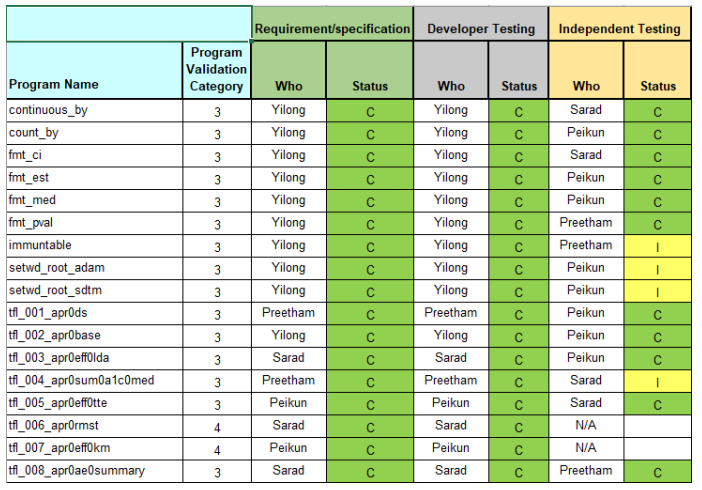

# Project Management {#manage}

## Setting up for Success

A clinical data analysis project is not unlike typical data analysis projects
or software projects. Therefore, the conventional wisdom and tricks for
managing a successful project are also applicable here.
At the same time, clinical projects also have unique traits,
such as high standards for planning, development, validation,
and delivery under strict time constraints.

Although many factors could decide if a project could execute efficiently,
we believe a few aspects are critical for the long-term success,
especially when managing clinical data analysis projects at scale.

### Work as a Team

As a general principle, all the team members involved in a project
should take basic training on project management and understand how to work as
a development team. @teamgeek provides some valuable tips on this topic.
As always, setting a clear goal and following a system development lifecycle
(SDLC) are essential.

### Design Clean Code Architecture

Having a clean architecture design for your code improves the project's
robustness and flexibility for future changes. For example,
we should understand how to separate business logic from other layers;
know what should be created as reusable components and what should be
written as one-off analysis scripts; write low coupling, high cohesion code,
and so on. @cleanarch offers some helpful insights on this topic.

### Set Capability Boundaries

Knowing what you can do is essential. Create a core capabilities list
for your team.

Sometimes, it is also critical to understand **what not to do**.
For example, the hidden cost of integrating with external systems
or involving other programming languages can be prohibitively high.
Remember, a simple, robust solution is almost always preferable to
a complex solution that requires high maintenance and constant attention.

### Contribute to the Community

Every individual is limited in some way. The collective thinking
from a community could benefit a project in the long term.
When designing reusable components, make a plan to share with
internal communities, or even better, with the open-source community.

## The SDLC

For A&R deliverables in clinical project development, 
a clearly defined process or system development lifecycle (SDLC) 
is crucial to ensure regulatory compliance. 

SDLC for A&R deliverables can be defined in four stages: 

- planning: a planning stage to define the scope of a project.  
- development: a development stage to implement target deliverables. 
- validation: a validation stage to verify target deliverables. 
- operation: an operation stage to deliver work to stakeholders. 

Importantly, we should not consider SDLC as a linear process. 
For example, if the study team identifies new requirement in a development or validation stage, 
the team should return to the planning stage to discuss and align the scope. 
An [agile project management](https://www.atlassian.com/agile/project-management) approach is suitable 
and recommended to an A&R clinical development project.
The goal is to embrace an iterative approach that continuously improves target deliverables based on
frequent stakeholder feedback. 

There are many good tools to implement agile project management strategy, for example:

- [GitHub project board](https://docs.github.com/en/issues/organizing-your-work-with-project-boards/managing-project-boards/about-project-boards)
- [Jira](https://www.atlassian.com/software/jira)

## Planning 

The planning stage is important in the SDLC lifecycle 
as the requirements for all A&R deliverables are gathered and documented. 

In the planning stage, a project leader should identify all the deliverables, 
e.g., a list of tables, listings, and figures (TLFs). 
For each TLFs, the team should prepare the necessary specifications: 

- mock-up tables
- validation level (e.g., independent review or double programming)
- etc.

The project leader should also align work assignments with team members.
The purpose is to answer the question of "who is doing what?"

```{r, out.width = "100%", out.height = "400px", echo = FALSE, fig.align = "center"}

```

The project lead should also set up a project folder as discussed in Chapter \@ref(folder).
The project initiation can be simplified by creating an 
[RStudio project template](https://rstudio.github.io/rstudio-extensions/rstudio_project_templates.html).  

To enable reproducibility, the project leader should also review the startup file 
(i.e. `.Rprofile` discussed in Section \@ref(reproduce)) and define:

- R version 
- Repository of R packages with a snapshot date 
- Project package library path 
- etc. 

> After project initiation, modifying `.Rprofile` will be a risk of reproducibility 
> and should be handled carefully if necessary. 

## Development 

After a project is initiated, the study team start to develop TLFs based on 
pre-defined mock-up tables assigned to each team member. 

The analysis code and relevant description can be saved in R markdown files 
in the `vignettes` folder. 

The use of R markdown allows developers to assemble narrative text, code, and its
comments in one place to simplify documentation. 
It would be helpful to create a template and define a name convention for all TLFs deliverables. 
For example, we can use `tlf_` prefix in the filename to indicate that the R Markdown is to deliver TLFs. 
Multiple TLFs with similar designs can be included in one R Markdown file. 

For example, in `esubdemo` project, we have 6 R Markdown files to create TLFs. 

If there is any project-specific R functions that need to be developed, 
the R functions can be placed in the `R/` folder as discussed in Section \@ref(consistency).

## Validation 

Validation is an crucial stage to ensure the deliverables are accurate and consistent. After the
development stage is completed, the project team needs to validate the deliverables, including R Markdown
files for TLFs deliverables and project-specific R functions. The level of validation is determined at the define
stage. 

In an R package development, the validation or testing is completed under the `test/` folder. 
The testthat R package can be used to streamline the validation process. 
More details of the `testthat` package for R package validation can be found in Chapter 12 of the R package book. 

It is recommended to have a name convention to indicate the type of validation. 
For example, we can use `test-developer-test`, `test-independent-test`, `test-double-programming` 
to classify the validation type. 

It is recommended to follow the same organization
for files in testthat folder as `R/` folder and `vignettes/` folder. 
Every single file in the `R/` folder and `vignettes/` folder should have a testing file saved in 
the `tests/testthat/` folder to validate the content.

For example, in `esubdemo` project, we can have a list of testing files below. 

```
tests/testthat
├── test-independent-test-tlf-01-disposition.Rmd
├── test-independent-test-tlf-02-population.Rmd
├── test-independent-test-tlf-03-baseline.Rmd
├── test-independent-test-tlf-04-efficacy.Rmd
├── test-independent-test-tlf-05-ae-summary.Rmd
├── test-independent-test-tlf-06-ae-spec.Rmd
└── test-independent-test-fmt.R
```

To validate the content of a Table, we can save the last datasets ready for table generation as a `.Rdata` file.
A validator can reproduce the TLF and compares it with the original result saved in `.Rdata` file. 
A test is passed when the results match. Customers can directly review the formatting of the TLFs by
customers by comparing them with the mock-up.

To validate a Figure, we can use [snapshot testing](https://testthat.r-lib.org/articles/snapshotting.html) strategy

After the validator completes the testing of project-specific functions and R Markdown files, 
the process to execute and report testing results is the same for a standard R package. 
The `devtools::test()` function automatically executes all testing cases and summarizes the testing results in a report. 

After completing the validation, the validator updates the status in a validation tracker. 
The project lead reviews the tracking sheet to make sure all required activities in the SDLC are completed and
the tracking sheet has been filled correctly. The deliverables are ready for customer review after all the
validation steps are completed. Any changes to the output requested by customers are documented.

## Operation 

After completion of development and required validation of all A&R deliverables, project lead runs compliance
check for a project-specific R package similar to other R packages. Using `devtools::check()` is a
convenient way to run compliance checks or `R CMD check`. `R CMD check` is an automated check of the
contents in the R package for frequently encountered issues, before submission to CRAN. Since the project-specific
R package is not submitted to CRAN, some checks can be customized and skipped in
`devtools::check()`. The project lead should work with the study team to ensure all reported errors, warnings, and
notes by `devtools::check()` are fixed. 

The project lead can also use the R package `pkgdown` to build a complete website for a project-specific R
package. The `pkgdown` website is a convenient way to run all analyses in batch and 
integrate outputs in a website. 

Project-specific R functions, TLF generation programs, outputs and validation tracking information can all
be explored from the website. 

For example, in the `esubdemo` project, we created the `pkgdown` website at <https://elong0527.github.io/esubdemo/>.

Many of the tasks in SDLC can be completed automatically. 
An organization can leverage CI/CD workflow to automatically enable those tasks 
such as running testing cases and creating a `pkgdown` website. 

For example, in `esubdemo` project, we setup [GitHub Actions](https://github.com/elong0527/esubdemo/actions)
for these work. It can be setup by using `usethis::use_github_action()` function.
