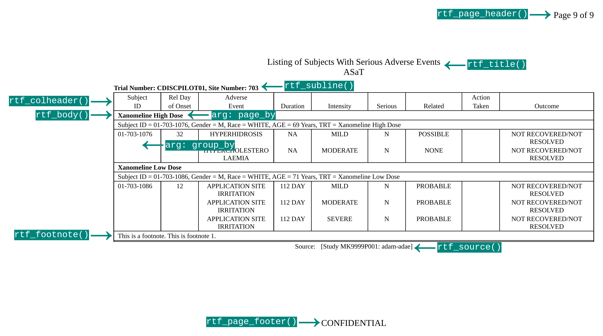

```{r setup, include=FALSE}
knitr::opts_chunk$set(echo = TRUE)
library(dplyr)
library(tidyr)
library(r2rtf)
library(ggplot2)
data("r2rtf_adae")
```

## Disclaimer

- All opinions expressed are those of the presenter and not
  Merck Sharp & Dohme Corp., a subsidiary of Merck & Co., Inc., Kenilworth, NJ, USA.

- Some slides need to be scrolled down to see the full content.

## Background

- Clinical study report is a key deliverable for clinical trials to regulatory agencies. (e.g., FDA, CFDA)
  - [ICH E3 Structure and Content of Clinical Study Reports](https://database.ich.org/sites/default/files/E3_Guideline.pdf)

- We try to fill in gaps to streamline workflow using R:
  - To develop, validate, deliver analysis results.
  - To submit analysis results to regulatory agencies in [eCTD format](https://en.wikipedia.org/wiki/Electronic_common_technical_document).

- Focus on table, listing, figure (TLFs) delivered in RTF/Microsoft Word format
  - In the pharmaceutical industry, RTF/Microsoft Word play a central role in preparing clinical study reports.
  - Different organization can have different table standards

## Clarification from FDA

- [FDA: Statistical Software Clarifying Statement](https://www.fda.gov/media/161196/download)

"FDA does not require use of any specific software for statistical analyses, and statistical software
is not explicitly discussed in Title 21 of the Code of Federal Regulations [e.g., in 21CFR part
11]. However, the software package(s) used for statistical analyses should be fully documented
in the submission, including version and build identification."

## Requirement from FDA

- [FDA Study Data Technical Conformance Guide](https://www.fda.gov/media/88173/download):

> "Sponsors should provide the software programs used to create all ADaM
datasets and **generate tables and figures associated with primary and
secondary efficacy analyses**. Furthermore, sponsors should submit software
programs used to generate additional information included in Section 14
CLINICAL STUDIES of the Prescribing Information (PI)26 if applicable.
**The specific software utilized should be specified in the ADRG**.
The main purpose of requesting the submission of these programs
**is to understand the process by which the variables for the respective
analyses were created and to confirm the analysis algorithms**.
Sponsors should submit software programs in **ASCII text format**;
however, executable file extensions should not be used."

## Philosophy

We share the same philosophy described in
[Section 1.1 of the R Packages book](https://r-pkgs.org/introduction.html#intro-phil) and quote here.

- "Anything that can be automated, should be automated."
- "Do as little as possible by hand. Do as much as possible with functions."
- "The goal is to spend your time thinking about what you want to do
rather than thinking about the minutiae of package structure."

## Tools for study design

> Details will be skipped in today's talk.

Tools:

- [`gsDesign`](https://github.com/keaven/gsDesign): an R package for group sequential design under proportional hazards.
- [`simtrial`](https://github.com/Merck/simtrial): an experimental R package for simulation-based group sequential design under non-proportional hazards
- [`gsDesign2`](https://github.com/Merck/gsDesign2) and
[`gsdmvn`](https://github.com/Merck/gsdmvn):
an experimental R package for analytical-based group sequential design under proportional hazards.

Bookdown: <https://keaven.github.io/gsd-deming/>

Training: [December 6th, Deming Conference 2021](https://web.archive.org/web/20220531042701/https://demingconference.org/wp-content/uploads/2021/11/2021-Deming-Conference-Virtual-Printed-Program-v1.1.pdf)

## Tools for reporting and submission

Tools:

- [r2rtf](https://merck.github.io/r2rtf/): create production-ready tables and figures in RTF format.
- [`pkglite`](https://merck.github.io/pkglite/): represent and exchange R package source code as text files.
- `cleanslate` (under internal validation): create portable R environments.

Bookdown: <https://r4csr.org/>

Training: [December 2nd, Short course for ASA Princeton-Trenton Chapter](https://rutgers.webex.com/rutgers/j.php?RGID=rc0a71b2f239233a7850a121cf972045f)

## r2rtf: design

r2rtf is designed to:

- Generate highly customized tables
- Limit package dependency
- Target regulatory deliverable
- Support pipes (`%>%`)

## r2rtf: minimal example

r2rtf is designed to be pipe-friendly (`%>%`)

```{r, echo = TRUE, eval = FALSE}
head(iris) %>%
  rtf_body() %>%           # Step 1 Add table attributes
  rtf_encode() %>%         # Step 2 Convert attributes to RTF encode
  write_rtf("minimal.rtf") # Step 3 Write to a .rtf file
```

```{r, out.width = "100%", out.height = "400px", echo = FALSE, fig.align = "center"}
knitr::include_graphics("minimal.pdf")
```

## r2rtf: function illustration

```{r, out.width="100%", echo=FALSE, fig.align="center"}

```

## pkglite: compact package representations

`pkglite` reimagines the way to represent R packages.

- A **tool** for packing and restoring R packages as plaintext
  assets that are easy to store, transfer, and review
- A **grammar** for specifying the file packing scope that is
  functional, precise, and extendable
- A **standard** for exchanging the packed asset that is
  unambiguous, human-friendly, and machine-readable

```{r, eval=FALSE}
library("pkglite")

"/path/to/pkg/" %>%
  collate(file_ectd(), file_auto("inst/")) %>%
  pack()

pack(
  "/path/to/pkg1/" %>% collate(file_ectd()),
  "/path/to/pkg2/" %>% collate(file_ectd()),
  output = "/path/to/pkglite.txt"
)

"/path/to/pkglite.txt" %>% unpack(output = "/path/to/output/", install = TRUE)
```

Website: <https://merck.github.io/pkglite/>

## cleanslate: portable R environments

- Create a project folder with specific context (`.Rproj`, `.Rprofile`, `.Renviron`)
- Install a specific version of R into the project folder
- Install a specific version of Rtools into the project folder
- (without administrator privileges)

```{r, eval=FALSE}
library("cleanslate")

"portable-project/" %>%
  use_project(repo = "https://url/snapshot/2021-11-20/") %>%
  use_rprofile() %>%
  use_renviron() %>%
  use_r_version(version = "4.1.1") %>%
  use_rtools(version = "rtools40")
```

## Summary of workflow as user stories

Within a regulatory R environment:

- As a statistician, I use tidyverse, r2rtf, and internal tools to define the mock-up table, listing and figure (TLFs) for statistical analysis of a clinical trial.
  - More than 100 TLFs for efficacy and safety of a drug or vaccine.

- As a programmer, I use tidyverse, r2rtf, and internal tools to develop and/or validate analysis results based on mock-up TLFs.

- As a statistican/programmer, I use `pkglite` and internal tools to prepare proprietary R packages and analysis R scripts for eCTD submission package.

- As an internal/external reviewer, I use `cleanslate` to re-construct a portable environment (if required) to reproduce analysis results.

More details: <https://r4csr.org/>

## Folder structure

We recommended to use **R package structure** to organize standard tools, analysis projects, and Shiny apps.

- Consistency: everyone works on the same folder structure.
- Reproducibility: analysis can be executed and reproduced by different team members months/years later.
- Automation: automatically check the integration of a project.
- Compliance: reduce compliance issues.

More details: <https://r4csr.org/project-folder.html>

Example: <https://github.com/elong0527/esubdemo>

## Project management

- Setting up for success
  - Work as a team
  - Design clean code architecture
  - Set capability boundaries
  - Contribute to the community

- The Software Development Life Cycle
  - Planning: define the scope of a project
  - Development: mplement target deliverables
  - Validation: verify target deliverables
  - Operation: deliver work to stakeholders

More details: <https://r4csr.org/project-management.html>

## Cross-industry collaborations

- R Validation Hub: <https://www.pharmar.org/>
  - Focus on designing a framework that assesses the quality of an R package
  - Presentations: <https://www.pharmar.org/present/>

- R-based submission pilots to FDA:
  - <https://rconsortium.github.io/r-submission-site/>
  - Focus on improving practices of R-based clinical trial regulatory submission.

- R/Pharma: <https://rinpharma.com/>
  - Annual conference focus on the use of R in the development of pharmaceuticals.

- R Consortium R Adoption Seminar Series
  - <https://www.r-consortium.org/webinars>

## Future directions

- Enhance compliance, reproducibility, traceability, and automation
  - Automation of analysis, documentation, review, and testing
  - Linkage among data, TLFs, and final reports
  - R package qualification
- Enable advanced study design and statistical methods
- Introduce interactive visualization and reporting (with/without backend server)

## Join us

- Contact us for R developer or Methodology Research Positions:
  - Yilong Zhang: <https://elong0527.github.io/>
  - Nan Xiao: <https://nanx.me/>
  - Keaven Anderson: <https://keaven.github.io/>

- Multiple open positions (statisticians/programmers) in China, EU, and US
  - US: <https://jobs.merck.com/bards>
  - China/EU: <https://jobs.msd.com/cn/zh>

# Thank you {.thank-you}
