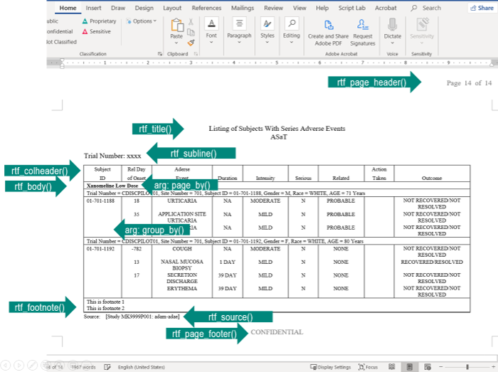

```{r setup, include=FALSE}
knitr::opts_chunk$set(comment = "#>", echo = FALSE)
```

```{css, echo = FALSE}
slides > slide.dark {
  background: #59B2D1 !important;
}

.dark hgroup {
  position: absolute;
  left: 5%;
  top: 40%;
}

slides > slide.title-slide {
  background: #f2f2f2;
}

.title-slide hgroup {
  position: absolute;
  left: 5%;
  top: 40%;
}

.title-slide hgroup h1 {
  color: #404040;
  font-size: 48px;
}

.title-slide hgroup h2 {
  color: #404040;
  font-size: 24px;
}

.title-slide hgroup p {
  color: #404040;
  font-size: 16px;
}

h1 {
 color: #404040;
}

h2 {
 color: #404040;
}

h3 {
 color: #404040;
}

p {
 color: #404040;
}

ul {
 color: #404040;
}

li {
 color: #404040;
}

a {
    color: #59B2D1;
    text-decoration: none;
    border-bottom: none;
}

a > code {
    color: #59B2D1;
    text-decoration: none;
    border-bottom: none;
}

slides > slide:not(.segue) > hgroup > h2 {
    font-size: 34px;
    line-height: 50px;
    padding: 0px 0px 10px 0px;
    border-bottom: 2px solid #59B2D1;
}
```

```{r, include=FALSE}
library(dplyr)
library(tidyr)
library(r2rtf)
```

# Welcome

## Outline

In this workshop, we have three parts:

- Delivering TLFs in CSR 
  - Session 1 (45 min)
  - Break and/or Exercise (20 min)
  - Session 2 (45 min)
  - Break (10 min)
- Clinical trial project 
  - Session 3 (30 min)
  - Break (10 min)
- eCTD submission package 
  - Session 4 (40 min)
  - Q&A (10 min)

## Disclaimer

- All opinions expressed are those of the presenter.

- Some slides need to be scrolled down to see the full content.

## Training Objective

- Learning how to create TLFs for clinical study reports.
- Learning how to organize a clinical development project.
- Learning how to prepare eCTD submission package to FDA.

> The toolchain, process, and formats may be different in different organizations.
> We only provide a recommended way to address them.

## Acknowledgement

- [Contributors](https://r4csr.org/preface.html#authors-and-contributors) of the training materials.
  - Please consider submitting issues or PR in the [github repo](https://github.com/elong0527/r4csr).

- [R Consortium](https://www.r-consortium.org/projects/isc-working-groups)
  - R validation hub
  - Submission working group
  - R Tables for Regulatory Submission (RTRS) working group
  - Please consider to join and contribute to a working group.

## Preparation

In this workshop, we assume you have
some R programming experience and clinical development knowledge.

- Data manipulation: `tidyverse`, `dplyr`, `tidyr`, `ggplot2` etc.
- ADaM data: `adsl`, `adae` etc.

```{r, echo = TRUE, eval = FALSE}
install.packages(c(
  "tidyverse", # Data manipulation
  "r2rtf",     # TLF generation
  "pkglite"    # eCTD submission
))
```

## Resource

- Training Material: <https://r4csr.org/>
- Demo project:
  - Analysis project: <https://github.com/elong0527/esubdemo>
  - eCTD submission package: <https://github.com/elong0527/ectddemo>
- R Consortium FDA submission pilot:
  - <https://github.com/RConsortium/submissions-pilot1>

- During the workshop, we will use `esubdemo` project.
  - `esubdemo` is shared in RStudio Cloud (<https://rstudio.cloud/>)
  - You can also clone the `esubdemo` project to your local RStudio.  

## Motivation

As an organization, we need to ensure compliance and reduce the risk of using R and R packages in regulatory deliverables.

- R is widely used in clinical trial study design.
  - Following @lachin1986evaluation
  - [`gsDesign`](https://github.com/keaven/gsDesign): an R package for group sequential design under proportional hazards.
  - [`simtrial`](https://github.com/Merck/simtrial),
  [`gsDesign2`](https://github.com/Merck/gsDesign2), and
  [`gsdmvn`](https://github.com/Merck/gsdmvn): experimental R packages for group sequential design under non-proportional hazards
  - Bookdown: <https://keaven.github.io/gsd-deming/>

- R is flexible for handling novel missing data approaches following the estimand framework in ICH E9 (R1)
  - Recurrent event data: @gao2017control @diao2020efficient
  - Robustness: @liu2021multiply

- R is used in Bayesian statistics.
  - [stan](https://mc-stan.org/users/interfaces/rstan) and network meta-analysis for drug reimbursement analysis

- R is widely used in visualization
  - [metalite.table1](https://elong0527.github.io/metalite.table1/articles/metalite-table1.html): Interactive demographic table.
  - [forestly](https://elong0527.github.io/forestly/articles/forestly.html): Interactive forest plot for DMC safety monitoring in clinical trials

## Philosophy

We share the same philosophy described in
[Section 1.1 of R Packages book](https://r-pkgs.org/intro.html#intro-phil) and quote here.

- "Anything that can be automated, should be automated."
- "Do as little as possible by hand. Do as much as possible with functions."
- "The goal is to spend your time thinking about what you want to do
rather than thinking about the minutiae of package structure."

# Delivering TLFs in CSR

## ICH E3 Guidance

The [ICH E3: structure and content of clinical study reports](https://database.ich.org/sites/default/files/E3_Guideline.pdf) 
provides guidance to assist sponsors in the development of a CSR.

In a CSR, most of TLFs are located in

- Section 10: Study patients
- Section 11: Efficacy evaluation
- Section 12: Safety evaluation
- Section 14: Tables, Figures and Graphs referred to but not included in the text
- Section 16: Appendices

## Datasets

- Public available [CDISC pilot study data](https://github.com/elong0527/r4csr/tree/master/data-adam).

- The dataset structure follows the [CDISC Analysis Data Model (ADaM)](https://www.cdisc.org/standards/foundational/adam).

## Tools

- `tidyverse`: a collection of R packages to simplify the workflow to manipulate,
visualize and analyze data in R.

- `r2rtf`: an R package to create production-ready tables and figures in RTF format.

# r2rtf Introduction

## Motivation

In the pharmaceutical industry, RTF/Microsoft Word play a central role
in preparing clinical study reports

- [ICH E3 Structure and Content of Clinical Study Reports](https://database.ich.org/sites/default/files/E3_Guideline.pdf)

Different organizations can have different table standards

- E.g., Table layout, Font size, Border type, Footnote, Data source

- `r2rtf` is an R package to create production-ready tables and figures in RTF format.

`r2rtf` is designed to:

- provide simple "verb" functions that correspond to each component of a table,
  to help you translate a data frame to a table in RTF format;
- enable pipes (`%>%`);
- only focus on the **table format**.
  - Data manipulation and analysis should be handled by other R packages. (e.g., `tidyverse`)

## Workflow

Before creating an RTF table, we need to:

- Figure out table layout.

- Split the layout into small tasks in the form of a computer program.

- Execute the program.

## Minimal Example

`r2rtf` is designed to enable pipes (`%>%`).

```{r, echo = TRUE, eval = FALSE}
head(iris) %>%
  rtf_body() %>%           # Step 1 Add table attributes
  rtf_encode() %>%         # Step 2 Convert attributes to RTF encode
  write_rtf("minimal.rtf") # Step 3 Write to a .rtf file
```

```{r, out.width = "100%", out.height = "400px", echo = FALSE, fig.align = "center"}
knitr::include_graphics("minimal.pdf")
```

## Package Overview

`r2rtf` package provides the flexibility to customize table appearance for

- **Table component**: title, column header, footnote, etc.
- **Table cell style**: size, border type, color, font size, text color, alignment, etc.
- **Flexible control**: the specification of the cell style can be row or column vectorized.
- **Complicated format**: pagination, section grouping, multiple table concatenations, etc.

`r2rtf` package also provides the flexibility to convert figures in RTF format.

## Function Summary

`r2rtf` provides simple "verb" functions that correspond to each component of a table,
  to help you translate data frame to tables in RTF file.

```{r, echo = FALSE}
r2rtf_funs <- read.csv("r2rtf-functions.csv")
names(r2rtf_funs)[3] <- "Optional/required"
knitr::kable(r2rtf_funs)
```

## Function Illustration

```{r, out.width="100%", echo=FALSE, fig.align="center"}

```

# Break and/or Exercise (20 min)

# CSR Examples

## Disposition Table

<https://r4csr.org/disposition.html>

## Analysis Population

<https://r4csr.org/population.html>

## Baseline Characteristics

<https://r4csr.org/baseline-characteristics.html>

## Efficacy Table

<https://r4csr.org/efficacy.html>

## AE Summary Table

<https://r4csr.org/aesummary.html>

## Specific AE Table

<https://r4csr.org/specific-ae.html>

## Assemble TLFs 

<https://r4csr.org/assemble.html>

# Break (10 min)

# Clinical Trial Project

## Overview

In a late-stage clinical trial, the number of A&R deliverables can easily be in the hundreds.

For an organization, it is also common to have multiple ongoing clinical trials in a clinical program.

In this part, let's consider how to organize a clinical trial project as an A&R lead.

## Folder Structure

Our primary focus is creating a standard R package structure to organize the
project, with 4 goals in mind:

- Consistency
- Reproducibility
- Automation
- Compliance

<https://r4csr.org/folder.html>

## Project Management

- Setting up for success
  - Teamwork
  - Architecture
  - Boundaries
  - Community

- The SDLC
  - Planning
  - Development
  - Validation
  - Operation

<https://r4csr.org/manage.html>

# Break (10 min)

# eCTD Submission

## Clarification from FDA

- [FDA: Statistical Software Clarifying Statement](https://www.fda.gov/files/about%20fda/published/Statistical-Software-Clarifying-Statement-PDF.pdf)

> "FDA does not require use of any specific software for statistical analyses, and statistical software
is not explicitly discussed in Title 21 of the Code of Federal Regulations [e.g., in 21CFR part
11]. However, the software package(s) used for statistical analyses should be fully documented
in the submission, including version and build identification."


## R Consortium Pilot Submission Working group 

- The R submission working group is a cross-industry pharma working group focusing on improving practices of R-based clinical trial regulatory submission.
  - [members and affiliations](https://rconsortium.github.io/submissions-wg/)
- Mission: Easier R-based clinical trial regulatory submissions
- [pilot 1 - common analyses](https://rconsortium.github.io/submissions-wg/pilot-overall.html#pilot-1---common-analyses)
  - 2021.11   Initial submission to FDA. 
  - 2022.12   Received FDA response 
  - 2022.02   Revised submission to FDA
  - 2022.03   Received final FDA response. 
 
## Challenges and Assumptions

### Challenges

- How to submit internally developed (proprietary) R packages?
- How to follow [ICH and/or FDA guidances](https://www.fda.gov/drugs/electronic-regulatory-submission-and-review/electronic-common-technical-document-ectd)
in preparing eCTD package?
- How to enhance reproducibility from FDA reviewer's perspective?

### Assumptions

- Focus on analysis and reporting given available ADaM datasets.

## Deliverables

- Open source pilot eCTD submission package to FDA
  - Proprietary R package
  - R scripts for analysis
  - Analysis data reviewer guide (ADRG)
  - etc.
- Development: <https://github.com/RConsortium/submissions-pilot1>
- eCTD package: <https://github.com/RConsortium/submissions-pilot1-to-fda>
- [R consortium announcement](https://www.r-consortium.org/blog/2021/12/08/successful-r-based-test-package-submitted-to-fda)

## FDA Response

### Initial Submission 

- "Using R version 4.1.1, FDA was able to run the submitted code and confirm the applicant's tables and the submitted figure in report-tlf pdf file."
- "Using FDA developed code, a statistical analyst was able to independently generate tables using the submitted data."
- [Initial submission FDA response](https://github.com/RConsortium/submissions-wg/blob/main/Documents/Summary_R_Pilot_Submission.pdf)

### Revised Submission 

- FDA agrees that the initial phase of the R Pilot submission has been completed.
- [Revised  submission FDA response](https://github.com/RConsortium/submissions-wg/blob/main/Documents/Summary_R_Pilot_Submission2.pdf)

## Future Work

- Pilot R Shiny app submission to FDA.
- Seek pilot submission opportunities to other regulator agencies. 
- Pilot submission with advanced analysis methods (e.g., study design, missing data, Bayesian, etc).

## Submission Package

We will discuss strategies to prepare proprietary R packages and analysis code
into proper formats for submission:

- The whole game
- Practical considerations
- Prepare R packages using `pkglite`
- Prepare analysis programs
- Update ADRG and ARM

<https://r4csr.org/submission-package.html>

## Running Environment

We will also give recommendations to make the R code
running environment reproducible for dry run tests and reviews
using `cleanslate`.

<https://r4csr.org/running-environment.html>

# pkglite

## pkglite: Compact Package Representations

- To provide a **tool** for packing and restoring R packages as plaintext
assets that are easy to store, transfer, and review.
- To provide a **grammar** for specifying the file packing scope that is
functional, precise, and extendable.
- To provide a **standard** for exchanging the packed asset that is
unambiguous, human-friendly, and machine-readable.

## Pipe-friendly Workflow

```{r, eval=FALSE, echo=TRUE}
library("pkglite")

"/path/to/pkg/" %>%
  collate(file_ectd()) %>%
  pack()

pack(
  "/path/to/pkg1/" %>% collate(file_ectd()),
  "/path/to/pkg2/" %>% collate(file_ectd()),
  output = "/path/to/pkglite.txt"
)

"/path/to/pkglite.txt" %>%
  unpack(output = "/path/to/output/")
```

## File Specifications + File Collections

File specifications offer flexibility and brevity in specifying the files to include.

| File specification type | Functions                                                                           |
|-------------------------|-------------------------------------------------------------------------------------|
| Manual discovery        | `file_spec()`                                                                       |
| Automatic discovery     | `file_auto()`                                                                       |
| Common patterns         | `file_root_core()`, `file_r()`, `file_man()`, `file_src()`, `file_vignettes()`, ... |
| Default sets            | `file_default()`, `file_ectd()`                                                     |

<br>

File collections contain the evaluation results of file specifications for packing.

```{r, eval=FALSE, echo=TRUE}
library("pkglite")

"/path/to/pkg" %>%
  collate(file_root_core(), file_r(), file_auto("inst/"))
```

## pkglite.txt

pkglite.txt follows the standard Debian Control File (DCF) format used by
Debian, R, and RStudio IDE, to be both machine-readable and human-readable.

```text
# Generated by pkglite: do not edit by hand
# Use pkglite::unpack() to restore the packages

Package: pkg1
File: DESCRIPTION
Format: text
Content:
  Package: pkg1
  Type: Package
  Title: Example Package One
  Version: 0.1.0
```

# Q&A

## References