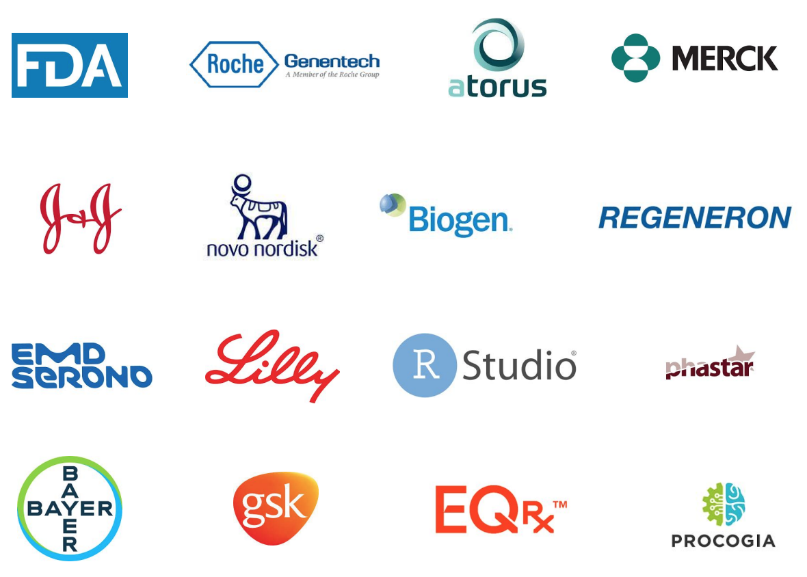

```{r setup, include=FALSE}
knitr::opts_chunk$set(echo = TRUE)
library(dplyr)
library(tidyr)
library(r2rtf)
library(ggplot2)
data("r2rtf_adae")
```

```{css, echo = FALSE}
slides > slide.dark {
  background: #59B2D1 !important;
}

.dark hgroup {
  position: absolute;
  left: 5%;
  top: 40%;
}

slides > slide.title-slide {
  background: #f2f2f2;
}

.title-slide hgroup {
  position: absolute;
  left: 5%;
  top: 40%;
}

.title-slide hgroup h1 {
  color: #404040;
  font-size: 48px;
}

.title-slide hgroup h2 {
  color: #404040;
  font-size: 24px;
}

.title-slide hgroup p {
  color: #404040;
  font-size: 16px;
}

h1 {
 color: #404040;
}

h2 {
 color: #404040;
}

h3 {
 color: #404040;
}

p {
 color: #404040;
}

ul {
 color: #404040;
}

li {
 color: #404040;
}

a {
    color: #59B2D1;
    text-decoration: none;
    border-bottom: none;
}

a > code {
    color: #59B2D1;
    text-decoration: none;
    border-bottom: none;
}

slides > slide:not(.segue) > hgroup > h2 {
    font-size: 34px;
    line-height: 50px;
    padding: 0px 0px 10px 0px;
    border-bottom: 2px solid #59B2D1;
}
```

## Disclaimer

- All opinions expressed are those of the presenter and do not represent any organization.

- Some slides need to be scrolled down to see the full content.

## Clarification from FDA

- [FDA: Statistical Software Clarifying Statement](https://www.fda.gov/files/about%20fda/published/Statistical-Software-Clarifying-Statement-PDF.pdf)

> "FDA does not require use of any specific software for statistical analyses, and statistical software
is not explicitly discussed in Title 21 of the Code of Federal Regulations [e.g., in 21CFR part
11]. However, the software package(s) used for statistical analyses should be fully documented
in the submission, including version and build identification."

## Motivation

As an organization, we need to ensure compliance and reduce the risk of using R and R packages in regulatory deliverables.

- R is widely used in clinical trial study design.
  - Following @lachin1986evaluation
  - [`gsDesign`](https://github.com/keaven/gsDesign): an R package for group sequential design under proportional hazards.
  - [`gsDesign2`](https://github.com/Merck/gsDesign2): experimental R packages for group sequential design under non-proportional hazards
  - Bookdown: <https://keaven.github.io/gsd-deming/>

- R is flexible for handling novel missing data approaches following the estimand framework in ICH E9 (R1)
  - Recurrent event data: @gao2017control @diao2020efficient
  - Robustness: @liu2021multiply

- R is used in Bayesian statistics.
  - [stan](https://mc-stan.org/users/interfaces/rstan) and network meta-analysis for drug reimbursement analysis

- R is widely used in visualization
  - [metalite.table1](https://elong0527.github.io/metalite.table1/articles/metalite-table1.html): Interactive demographic table.
  - [forestly](https://elong0527.github.io/forestly/articles/example.html#construct-interactive-forest-plot-1): [Interactive forest plot for DMC safety monitoring in clinical trials](https://rinpharma.com/publication/rinpharma_206/)

## Background

- Clinical study report is a key deliverable for clinical trials to regulatory agencies. (e.g., FDA, CFDA)
  - [ICH E3 Structure and Content of Clinical Study Reports](https://database.ich.org/sites/default/files/E3_Guideline.pdf).

- We try to fill in gaps to streamline workflow using R for clinical trial development:
  - To develop, validate, and deliver analysis results.
  - To submit analysis results to regulatory agencies in [eCTD format](https://en.wikipedia.org/wiki/Electronic_common_technical_document).

- Focus on table, listing, figure (TLFs) delivered in RTF/Microsoft Word format.
  - In the pharmaceutical industry, RTF/Microsoft Word play a central role in preparing clinical study reports.
  - Different organizations can have different table standards.

# R Consortium Pilot Submission

## The R Consortium R Submission Working Group

- The R submission working group is a cross-industry pharma working group focusing on improving practices of R-based clinical trial regulatory submission.
  - [members and affiliations](https://rconsortium.github.io/submissions-wg/)
  
```{r, out.width = "60%", echo = FALSE, fig.align = "center"}

```

## Objective and Timeline 

- Objective: Create open source example for R-based clinical trial regulatory submissions
- [pilot 1 - common analyses](https://rconsortium.github.io/submissions-wg/pilot-overall.html#pilot-1---common-analyses)
  - 2021.11   Initial submission to FDA. 
  - 2022.12   Received FDA response 
  - 2022.02   Revised submission to FDA
  - 2022.03   Received final FDA response. 
  
- [pilot 2 - shiny app](https://github.com/RConsortium/submissions-pilot2-to-fda)
  - 2022.10   Public review of initial submission to FDA.

- [pilot 3 - ADaM data](https://github.com/RConsortium/submissions-wg/blob/main/Documents/R%20Submission%20%20Pilot%201%20Extension%20Proposal.pdf)
  - 2022.10   Proposal initiation.
  
## Pilot 1 Challenges and Assumptions

### Challenges

- How to submit internally developed (proprietary) R packages?
- How to follow [ICH and/or FDA guidances](https://www.fda.gov/drugs/electronic-regulatory-submission-and-review/electronic-common-technical-document-ectd)
in preparing eCTD package?
- How to enhance reproducibility from FDA reviewer's perspective?

### Assumptions

- Focus on analysis and reporting given available ADaM datasets.

## Deliverables

- Open source pilot eCTD submission package to FDA
  - Proprietary R package
  - R scripts for analysis
  - Analysis data reviewer guide (ADRG)
  - etc.
- Development: <https://github.com/RConsortium/submissions-pilot1>
- eCTD package: <https://github.com/RConsortium/submissions-pilot1-to-fda>
- [R consortium announcement](https://www.r-consortium.org/blog/2021/12/08/successful-r-based-test-package-submitted-to-fda)

## FDA Response

### Initial Submission 

- "Using R version 4.1.1, FDA was able to run the submitted code and confirm the applicant's tables and the submitted figure in report-tlf pdf file."
- "Using FDA developed code, a statistical analyst was able to independently generate tables using the submitted data."
- [Initial submission FDA response](https://github.com/RConsortium/submissions-wg/blob/main/Documents/Summary_R_Pilot_Submission.pdf)

### Revised Submission 

- FDA agrees that the initial phase of the R Pilot submission has been completed.
- [Revised  submission FDA response](https://github.com/RConsortium/submissions-wg/blob/main/Documents/Summary_R_Pilot_Submission2.pdf)

## Future Work

- Seek pilot submission opportunities to other regulator agencies. 
- Pilot submission with advanced analysis methods (e.g., study design, missing data, Bayesian, etc).

# Reproducibility

## Reproducibility Spectrum

```{r, out.width = "100%", out.height = "400px", echo = FALSE, fig.align = "center"}
knitr::include_graphics("reproducibility.png")
```

## Requirement from FDA

- [FDA Study Data Technical Conformance Guide](https://www.fda.gov/media/88173/download):

> "Sponsors should provide the software programs used to create all ADaM
datasets and **generate tables and figures associated with primary and
secondary efficacy analyses**. Furthermore, sponsors should submit software
programs used to generate additional information included in Section 14
CLINICAL STUDIES of the Prescribing Information (PI)26 if applicable.
**The specific software utilized should be specified in the ADRG**.
The main purpose of requesting the submission of these programs
**is to understand the process by which the variables for the respective
analyses were created and to confirm the analysis algorithms**.
Sponsors should submit software programs in **ASCII text format**;
however, executable file extensions should not be used."

## Recommendations

Although FDA did not expect submitted R code is executable,
sponsor shall enhance reproducibility.

- Fixed R version: e.g., R 4.1.0
- Fixed R package snapshot date: e.g., 2021-08-31
  - [RStudio Public Package Manager](https://packagemanager.rstudio.com/)
  - [CRAN Time Machine by MRAN](https://mran.microsoft.com/timemachine)
- Flexibility of input and output path:
  - Define path as parameter.
- eCTD deliverables dry-run in Windows environment
- Provide steps to follow in [ADRG appendix](https://github.com/RConsortium/submissions-pilot1-to-fda/blob/main/m5/datasets/rconsortiumpilot1/analysis/adam/datasets/adrg.pdf)

# Implementation

## Philosophy

We share the same philosophy described in
[Section 1.1 of the R Packages book](https://r-pkgs.org/introduction.html#intro-phil) and quote here.

- "Anything that can be automated, should be automated."
- "Do as little as possible by hand. Do as much as possible with functions."
- "The goal is to spend your time thinking about what you want to do
rather than thinking about the minutiae of package structure."

## Tools for Submission

- Tool: [`pkglite`](https://merck.github.io/pkglite/), represent and exchange R package source code as text files.

- Reference: @zhao2022electronic

- Book: <https://r4csr.org/>

## pkglite: Compact Package Representations

`pkglite` reimagines the way to represent R packages.

- A **tool** for packing and restoring R packages as plaintext
  assets that are easy to store, transfer, and review
- A **grammar** for specifying the file packing scope that is
  functional, precise, and extendable
- A **standard** for exchanging the packed asset that is
  unambiguous, human-friendly, and machine-readable

```{r, eval=FALSE}
library("pkglite")

"/path/to/pkg/" %>%
  collate(file_ectd(), file_auto("inst/")) %>%
  pack()

pack(
  "/path/to/pkg1/" %>% collate(file_ectd()),
  "/path/to/pkg2/" %>% collate(file_ectd()),
  output = "/path/to/pkglite.txt"
)

"/path/to/pkglite.txt" %>% unpack(output = "/path/to/output/", install = TRUE)
```

## Folder Structure

We recommended to use **R package structure** to organize standard tools, analysis projects, and Shiny apps.

- Consistency: everyone works on the same folder structure.
- Reproducibility: analysis can be executed and reproduced by different team members months/years later.
- Automation: automatically check the integration of a project.
- Compliance: reduce compliance issues.

More details: <https://r4csr.org/project-folder.html>

Example: <https://github.com/elong0527/esubdemo>

## Project Management

- Setting up for success
  - Work as a team
  - Design clean code architecture
  - Set capability boundaries
  - Contribute to the community

- The Software Development Life Cycle
  - Planning: define the scope of a project
  - Development: implement target deliverables
  - Validation: verify target deliverables
  - Operation: deliver work to stakeholders

More details: <https://r4csr.org/manage.html>

## Cross-industry Collaborations

- R Validation Hub: <https://www.pharmar.org/>
  - Focus on designing a framework that assesses the quality of an R package
  - Presentations: <https://www.pharmar.org/present/>

- R-based submission pilots to FDA:
  - <https://rconsortium.github.io/r-submission-site/>
  - Focus on improving practices of R-based clinical trial regulatory submission.

- R/Pharma: <https://rinpharma.com/>
  - The annual conference focus on the use of R in the development of pharmaceuticals.

- R Consortium R Adoption Seminar Series
  - <https://www.r-consortium.org/webinars>

## Future Directions

- Enhance compliance, reproducibility, traceability, and automation
  - Automation of analysis, documentation, review, and testing
  - Linkage among data, TLFs, and final reports
  - R package qualification
- Enable advanced study design and statistical methods
- Introduce interactive visualization and reporting (with/without backend server)

# Thank you {.thank-you}

## References
