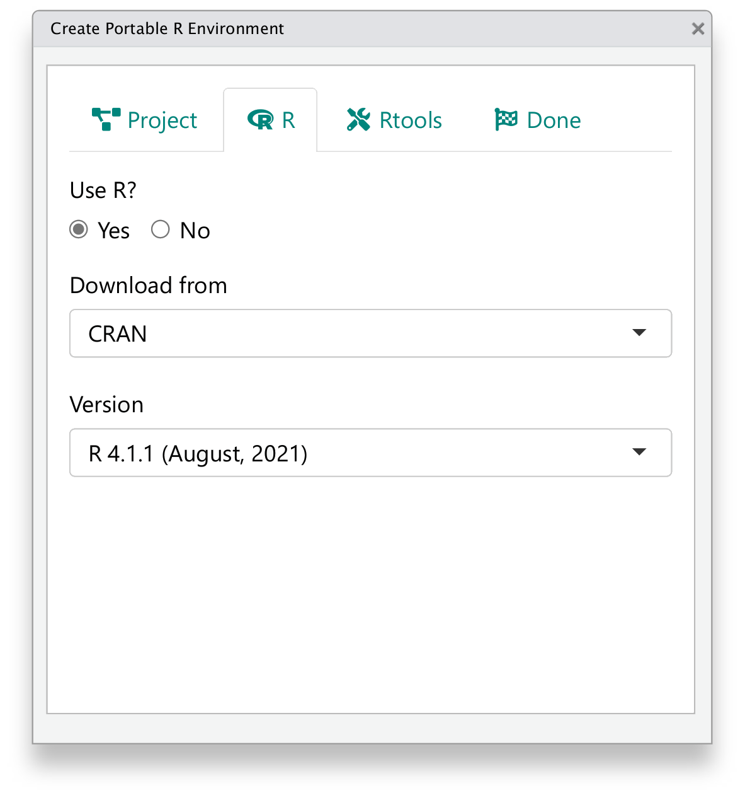

# Running environment {#running-environment}

In the previous chapter, we have generated instructions to manually
create the running environments for reproducing the A&R deliverables.

In this chapter, we will focus on automating the creation of
the R environments with R code, to accelerate the dry run testing process,
simplify the ADRG instructions, and make it easy to recreate
different environment settings with reproducible analysis results.

## Prerequisites

`cleanslate` is an R package that offers a solution to
create portable R environments.

::: {.rmdnote}
As of Q4 2021, the `cleanslate` package used in this chapter
is still under active development and validation.
This chapter gives a preview of the planned APIs.
They may change in the future.
:::

Install `cleanslate` from CRAN (once available):

```{r, eval=FALSE}
install.packages("cleanslate")
```

Or from GitHub (once available):

```{r, eval=FALSE}
remotes::install_github("Merck/cleanslate")
```

## Practical considerations

The `cleanslate` package supports:

- Creating a project folder with project-specific context
  (`.Rproj`, `.Rprofile`, `.Renviron`)
- Installing a specific version of R into the project folder
- Installing a specific version of Rtools into the project folder

An essential feature of `cleanslate` is that it does **not** require
administrator privileges to run R and Rtools installers.
This makes it easier to deploy under enterprise settings
and avoids security and portability concerns.

As many of the A&R deliverables are currently created, validated, and delivered
under Windows, the primary focus is Windows at the moment,
while the support for other platforms might be added in future versions.

## Create canonical environments

One can create a running environment with "canonical" settings with a
single function call to `use_cleanslate()`:

```{r, eval=FALSE}
cleanslate::use_cleanslate(
  "C:/temp/",
  r_version = "4.1.1",
  from = "https://cran.r-project.org/",
  repo = "https://mran.microsoft.com/snapshot/2021-08-06/"
)
```

This will

- Create a project folder under `C:/temp/` with a `.Rproj` file;
- Download R `4.1.1` installer from CRAN, install it into `C:/temp/R/`;
- Not install Rtools (by default, `rtools_version = NULL`);
- Create a `.Rprofile` file under the project folder, set `options(repos)`
  to use the specified `repo` (an MRAN snapshot in this example),
  and instructions to set the R binary path in RStudio;
- Create a `.Renviron` file under the project folder and set the
  library path to be the library of the project-specific R installation.

As a principle, one should always double-click the `.Rproj` file to
open the project.
This will ensure some sanity checks in the `.Rprofile`, such as whether the
R and library are located within the project folder.

## Create tailored environments

To create a more customized running environment, one can use the specific
functions to tailor each aspect, for example:

```{r, eval=FALSE}
library("cleanslate")

"C:/temp/" %>%
  use_project() %>%
  use_rprofile() %>%
  use_renviron() %>%
  use_r_version(version = "4.1.1") %>%
  use_rtools(version = "rtools40")
```

The project context functions
(`use_project()`, `use_rprofile()`, `use_renviron`) support custom templates
using [brew](https://cran.r-project.org/package=brew).

The `use_r_*()` functions have variations that serve as shortcuts
to use R versions defined by release lifecycles, for example,
`use_r_release()`, `use_r_oldrel()`, and `use_r_devel()`.
Note that to ensure better reproducibility, one should still use
`use_r_version()` as the release, oldrel, and devel versions will
shift as time goes by.

The helper functions `version_*()` and `snapshot_*()` could assist you
to determine specific versions of R and Rtools that are currently available,
besides generating and verifying the snapshot repo links.

## Update ADRG

If using `cleanslate`, remember to update the ADRG instructions for
executing the analysis programs in R. Mostly, this would simplify
the first three steps on creating a project, installing a specific
version of R, and configuring the package repo location.
For example:

```markdown
Appendix: Instructions to Execute Analysis Program in R

1. Setup R environment

Open the existing R, install the required packages by running the code below.

install.packages("cleanslate")

Create a temporary working directory, for example, "C:\tempwork".
Copy all submitted R programs into the temporary folder.
In the same R session, run the code below to create a project
with a portable R environment.

cleanslate::use_cleanslate(
  "C:/temp/",
  r_version = "4.1.1",
  from = "https://cran.r-project.org/",
  repo = "https://mran.microsoft.com/snapshot/2021-08-06/"
)

2. Open the project

Go to the working directory created above, double click the .Rproj file
to open the project in RStudio. Follow the instructions to select the
project-specific R version then restart RStudio. If successful,
the R version and package repo should be printed as defined above.

3. Install open-source R packages

In the new R session, install the required packages by running the code below.

install.packages(c("pkglite", "publicpkg1", "publicpkg2"))

4. Install proprietary R packages

All internal R packages are packed in the file r0pkgs.txt. In the same R session,
restore the package structures and install them by running the code below.
Adjust the output path as needed to use a writable local directory.

pkglite::unpack("r0pkgs.txt", output = ".", install = TRUE)

5. Update path to dataset and TLFs

INPUT path: to rerun the analysis programs, define the path variable

- Path for ADaM data: path$adam

OUTPUT path: to save the analysis results, define the path variable

- Path for output TLFs: path$output

All these paths need to be defined before executing the analysis program. For example:

path = list(adam = "/path/to/esub/analysis/adam/datasets/") # Modify to use actual location
path$outtable = path$outgraph = "." # Outputs saved to the current folder

6. Execute analysis program

To reproduce the analysis results, rerun the following programs:

- tlf-01-disposition.txt
- tlf-02-population.txt
- tlf-03-baseline.txt
- tlf-04-efficacy.txt
- tlf-05-ae-summary.txt
- tlf-06-ae-spec.txt
```

## RStudio addin

To make it convenient to use `cleanslate` in experiments,
one can also use its RStudio addin. After `cleanslate`
is installed, click `Addins` -> `cleanslate` -> `Create portable R environment`
in RStudio, or call `cleanslate:::create_env_addin()` to open it.

```{r, out.width="65%", echo=FALSE, fig.cap="cleanslate RStudio addin"}

```

The addin provides a wizard-like interface to help create the environment
with the most important options, although with less flexibility compared
to the functional API demonstrated above.
