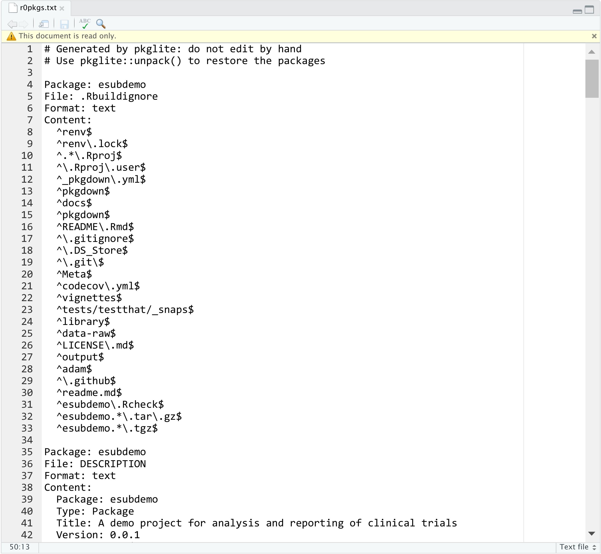

# Submission package {#submission-package}

In this chapter, we will first give a high-level overview of what
assets in the eCTD submission package we should focus on when
submitting R code.
Secondly, we will discuss how to prepare the proprietary R packages
(if any), and make them part of the submission package.
Lastly, we will provide reusable templates for updating ADaM Reviewer's Guide (ADRG) and Analysis Results Metadata (ARM),
so that the reviewers receive proper instructions to reproduce the
analysis results.

## Prerequisites

This chapter uses `pkglite` to convert R source packages
into text files and back.

```{r, eval=FALSE}
install.packages("pkglite")
```

The demo project (R package) we will prepare for submission is called [`esubdemo`](https://github.com/elong0527/esubdemo) available on GitHub.
You can download or clone it:

```bash
git clone https://github.com/elong0527/esubdemo.git
```

## The whole game

In eCTD deliverable, the analysis dataset and source code are saved 
under the module 5 folder `m5/datasets/<study>/analysis/adam`.

For illustration and preparation purpose, we temporarily save
the under the `vignettes/esub/` folder.

The files in two directories within the `adam/` folder
are critical for documenting analysis using R: `datasets/`
and `programs/`. 

```
vignettes/esub/analysis/adam/
├── datasets
│   ├── adrg.docx
│   ├── analysis-results-metadata.docx
│   ├── define-v1-updated-html.xsl
│   ├── define.pdf
│   └── define.xml
└── programs
    ├── tlf-01-disposition.txt
    ├── tlf-02-population.txt
    ├── tlf-03-baseline.txt
    ├── tlf-04-efficacy.txt
    ├── tlf-05-ae-summary.txt
    ├── tlf-06-ae-spec.txt
    └── r0pkgs.txt
```

The special considerations for each component are listed below.

### `datasets`

Folder path: `vignettes/esub/analysis/adam/datasets/`.

- ADaM data in `.xpt` format: created by SAS or R.
- `define.xml`: created by Pinnacle 21.
- ADRG (ADaM Reviewer's Guide)
  - "Macro Programs" section: provide R and R package versions with a snapshot date.
  - Appendix: provide step-by-step instructions for reviewers to
    reproduce the running environment and rerun analyses.
- ARM (Analysis Results Metadata): provide the links between TLFs and
  analysis programs in tables.

### `programs`

Folder path: `vignettes/esub/analysis/adam/programs/`.

- `r0pkgs.txt`: contains all internally developed proprietary R packages.
- Other `.txt` files: each contains R code for a specific analysis.

### Notes

To verify if the submission package works, rerun all analyses following the
instructions defined in ADRG.

A few things to pay attention to for passing compliance checks:

- The filenames under `programs` should all use lower case
(with no underscores or other special characters).
- The `.txt` files should only contain ASCII characters.
This can be verified by `pkglite::verify_ascii()`
- The `.docx` files will be converted to PDF files for formal submission.

Now you have a general idea about the relevant components of the
submission package. 
We will focus on preparing the internal R packages in the following sections.

## Practical considerations for R package submissions

Before we start, there are a few aspects to figure out,
to accurately identify the R packages for submission.

### Source location

There are a few common places to host R (source) packages:

1. CRAN
1. Public Git repository
1. Private Git repository (accessible externally)
1. Private Git repository (inaccessible externally)

For R packages hosted on CRAN or a public Git repository,
you probably do not need to submit them as part of the submission package,
as the reviewers can install them directly by following the instructions in ADRG.

For R packages hosted in private repositories, to avoid any complications
in infrastructure, authentication, and communication, it is often
recommended to submit them as part of the submission package.

### Dependency locations

R package dependencies is another major factor to consider
before preparing your proprietary R package for submission.

For dependencies available from CRAN or public Git repositories,
you can declare them directly using the regular `Imports` and `Suggests`
syntax or the
[remotes dependency syntax](https://remotes.r-lib.org/articles/dependencies.html) in the `DESCRIPTION` file.

For dependencies hosted in private Git repositories, you should pack them
with the primary R package(s) you want to submit,
as `pkglite` supports packing multiple R packages into a single text file;
then restore and install them in the order they are packed.

### R version

Always use a consistent version of R for developing the TLFs and for submission.
For example, you could enforce a rule to only use R `x.y.z` where `z = 1`,
such as R `4.0.1` or R `4.1.1`.
This can be automatically checked using a
[startup script](https://github.com/elong0527/esubdemo/blob/master/inst/startup.R) when the R project is opened.

### Package repo version

Always use the same snapshot package repo for developing the TLFs and for submission.
Again, this can be checked in the project startup script,
discussed in section \@ref(reproduce).

### System environments

Introducing any extra external dependencies will likely increase the cost
of qualification, validation, and testing, and maintenance,
especially under Windows.
Therefore, it is recommended to keep the dependency chain simple,
especially when involving compiled code (e.g., C, C++, Fortran).

## Prepare R Packages for submission

To prepare R packages for submission, one needs to pack the packages into text files, and then verify if the file only contains ASSCII characters.
With packed packages, one can unpack and install them from the text file, too.

### Pack

Let's pack the `esubdemo` package into a text file.
Assume the source package path is `~/esubdemo/`,
you should be able to pack the package with a single pipe:

```{r, eval=FALSE}
library("pkglite")

"~/esubdemo/" %>%
  collate(file_ectd(), file_auto("inst")) %>%
  pack(output = "r0pkgs.txt")
```

```{r, fig.cap="Output of pkglite::pack()", out.width="100%", echo=FALSE}
knitr::include_graphics("images/pack.png")
```

Let's open the generated text file:

```{r, eval=FALSE}
file.edit("r0pkgs.txt")
```

```{r, fig.cap="Preview the generated text file", out.width="100%", echo=FALSE}

```

What happened in the pipe? 
The function `pkglite::collate()` evaluates a specified scope of folders and files defined by a list of **file specifications**, and generate a **file collection** object.
This file collection contains the metadata required to properly convert
the files into text which is then used by `pkglite::pack()`.
With this flow, you can define the scope of the R source package
to be packed for submission in a flexible yet principled way.

To pack multiple R packages, simply feed multiple file collection as inputs:

```{r, eval=FALSE}
pack(
  "/path/to/pkg1/" %>% collate(file_ectd()),
  "/path/to/pkg2/" %>% collate(file_ectd()),
  output = "r0pkgs.txt"
)
```

The packages are always packed in the specified order and are always
unpacked and installed in the same order. Therefore, make sure to
pack the low-level dependencies first.

For more details on how to customize file specifications
and operate on file collections,
check out the vignette
[Generate File Specifications](https://merck.github.io/pkglite/articles/filespec.html)
and
[Curate File Collections](https://merck.github.io/pkglite/articles/filecollection.html).

### Verify

You should always verify if the file only contains ASCII characters:

```{r, eval=FALSE}
verify_ascii("r0pkgs.txt")
```

This should give `TRUE` if the file only contains ASCII characters,
or `FALSE` with the affected lines otherwise.

### Unpack

One can unpack and install the package from the text file, too.
For example:

```{r, eval = FALSE}
pkglite::unpack("r0pkgs.txt", output = "/tmp/", install = TRUE)
```

If successfully tested, this command will be used in the ADRG instructions
for restoring and installing the packed R package(s).

You can then proceed to save the file `r0pkgs.txt` to the folder
`esub/analysis/adam/programs` (or specify the output text file
path above directly).

## Prepare analysis programs for submission

Besides the R packages, we need to convert the R Markdown (`.Rmd`) files
into `.txt` files and saved them in the `programs` folder.
You can do this with `knitr::purl()`:

```{r, eval=FALSE}
input_path <- "~/esubdemo/vignettes/"
output_path <- "~/ectddemo/m5/datasets/ectddemo/analysis/adam/programs/"
knitr::purl(file.path(input_path, "tlf-01-disposition.Rmd"), output = file.path(output_path, "tlf-01-disposition.txt"))
knitr::purl(file.path(input_path, "tlf-02-population.Rmd"), output = file.path(output_path, "tlf-02-population.txt"))
knitr::purl(file.path(input_path, "tlf-03-baseline.Rmd"), output = file.path(output_path, "tlf-03-baseline.txt"))
knitr::purl(file.path(input_path, "tlf-04-efficacy.Rmd"), output = file.path(output_path, "tlf-04-efficacy.txt"))
knitr::purl(file.path(input_path, "tlf-05-ae-summary.Rmd"), output = file.path(output_path, "tlf-05-ae-summary.txt"))
knitr::purl(file.path(input_path, "tlf-06-ae-spec.Rmd"), output = file.path(output_path, "tlf-06-ae-spec.txt"))
```

Run this on all the R Markdown files under `vignettes/`.

Optionally, you can add a header to the individual `.txt` files to explain
the context and help the reviewers rerun the code. For example:

```r
# Note to Reviewer
# To rerun the code below, please refer to the ADRG appendix.
# After the required packages are installed,
# the path variable needs to be defined by using the example code below.
#
# path = list(adam = "/path/to/esub/analysis/adam/datasets") # Modify to use actual location
# path$outtable = path$outgraph = "." # Outputs saved to the current folder
```

To automate this process:

```{r, eval=FALSE}
header <- readLines(textConnection("# Note to Reviewer
# To rerun the code below, please refer to the ADRG appendix.
# After the required packages are installed,
# the path variable needs to be defined by using the example code below.
#
# path = list(adam = \"/path/to/esub/analysis/adam/datasets\") # Modify to use actual location
# path$outtable = path$outgraph = \".\" # Outputs saved to the current folder"))

append_header <- function(file, header) {
  x <- readLines(file)
  y <- c(header, "\n", x)
  writeLines(y, con = file)
  invisible(file)
}

file.path(output_path, "tlf-01-disposition.txt") %>% append_header(header)
file.path(output_path, "tlf-02-population.txt") %>% append_header(header)
file.path(output_path, "tlf-03-baseline.txt") %>% append_header(header)
file.path(output_path, "tlf-04-efficacy.txt") %>% append_header(header)
file.path(output_path, "tlf-05-ae-summary.txt") %>% append_header(header)
file.path(output_path, "tlf-06-ae-spec.txt") %>% append_header(header)
```

## Update ADRG

After we converted the R packages and R Markdown files into the appropriate
formats and verified that they can be restored and executed correctly,
we should update the ADRG to provide guidelines on how to use them.

Specifically, we need to update two sections.
The first is the "Macro Programs" section, where
R and R package versions with a snapshot date are provided.

For example:

```markdown
7.x Macro Programs

Submitted R programs have [specific patterns] in filenames.
All internally developed R functions are saved in the r0pkgs.txt file.
The recommended steps to unpack these R functions for analysis output
programs are described in Appendix.

The table below contains the software version and instructions
for executing the R analysis output programs:
```

| Software or Package                            | Version |
|------------------------------------------------|---------|
| R                                              | 4.1.1   |
| dplyr                                          | 1.0.7   |
| r2rtf                                          | 0.3.0   |
| pkglite                                        | 0.2.0   |
| ...                                            | ...     |
| R package versions based on CRAN at 2021-08-06 |         |

The second section (Appendix) should include step-by-step instructions
to reproduce the running environment and rerun analyses. For example:

```markdown
Appendix: Instructions to Execute Analysis Program in R

1. Install R

Download and install R 4.1.1 for Windows from
https://cran.r-project.org/bin/windows/base/old/4.1.1/R-4.1.1-win.exe

2. Define working directory

Create a temporary working directory, for example, "C:\tempwork".
Copy all submitted R programs into the temporary folder.
All steps below should be executed in this working directory
represented as "." in the example R code below.

3. Specify R package repository

The R packages are based on CRAN at 2021-08-06. To install the exact
R package versions used in this project, run the code below to set
the snapshot repository.

options(repos = "https://mran.microsoft.com/snapshot/2021-08-06/")

4. Install open-source R packages

In the same R session, install the required packages by running the code below.

install.packages(c("pkglite", "publicpkg1", "publicpkg2"))

5. Install proprietary R packages

All internal R packages are packed in the file r0pkgs.txt. In the same R session,
restore the package structures and install them by running the code below.
Adjust the output path as needed to use a writable local directory.

pkglite::unpack("r0pkgs.txt", output = ".", install = TRUE)

6. Update path to dataset and TLFs

INPUT path: to rerun the analysis programs, define the path variable

- Path for ADaM data: path$adam

OUTPUT path: to save the analysis results, define the path variable

- Path for output TLFs: path$output

All these paths need to be defined before executing the analysis program. For example:

path = list(adam = "/path/to/esub/analysis/adam/datasets/") # Modify to use actual location
path$outtable = path$outgraph = "." # Outputs saved to the current folder

7. Execute analysis program

To reproduce the analysis results, rerun the following programs:

- tlf-01-disposition.txt
- tlf-02-population.txt
- tlf-03-baseline.txt
- tlf-04-efficacy.txt
- tlf-05-ae-summary.txt
- tlf-06-ae-spec.txt
```

## Update ARM

The ARM (Analysis Results Metadata) should provide specific information
related to R in two sections:

- Section 2: indicate the **Programming Language**
- Section 3: document the details of the R programs listed in section 3.

For example, in ARM section 2, "Analysis Results Metadata Summary":

+--------------------------------------+-------------+----------------------+-------------------------+---------------------------------------+
| Table Reference                      | Table Title | Programming Language | Program Name (programs) | Input File Name / Analysis (datasets) |
+======================================+=============+======================+=========================+=======================================+
| [Ref. x.y.z: P001ZZZ9999: Table 1-1] | ...         | R                    | tlf-01-disposition.txt  | adsl.xpt                              |
+--------------------------------------+-------------+----------------------+-------------------------+---------------------------------------+
| ...                                  | ...         | ...                  | ...                     | ...                                   |
+--------------------------------------+-------------+----------------------+-------------------------+---------------------------------------+

In ARM section 3, "Analysis Results Metadata Details":

|                                                       |                                                               |
|-------------------------------------------------------|---------------------------------------------------------------|
| Table Reference: [Ref. x.y.z: P001ZZZ9999: Table 1-1] | ...                                                           |
| Analysis Result                                       | ...                                                           |
| Analysis Parameters (s)                               | ...                                                           |
| Analysis Reason                                       | ...                                                           |
| Analysis Purpose                                      | ...                                                           |
| ...                                                   | ...                                                           |
| Programming Statements                                | (R version 4.1.1), [P001ZZZ9999: programs-tlf-01-disposition] |
