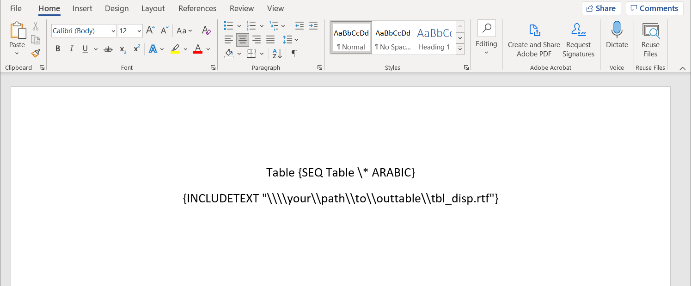

# Assemble TLFs {#assemble}

```{r, include=FALSE}
source("common.R")
```

```{r}
library(r2rtf)
```

After TLFs are created and saved into individual files, 
we need to assemble them into one file in a pre-specified order. 

There are two general approaches to achieving the goal. 

1. Combine RTF source code in individual files into one large RTF file. 
1. Leverage Microsoft Word `Toggle Fields` feature to embed RTF files using 
hyperlinks. 

Let's illustrate the idea by using selected TLFs generated from previous chapters. 
Here, we assume files are saved in the `tlf/` folder. 

```{r}
tlf_path <- c(
  "tlf/tbl_disp.rtf", # Disposition table
  "tlf/tlf_eff.rtf",  # Efficacy table
  "tlf/tlf_km.rtf"    # K-M plot
)
```

```{r, out.width = "100%", out.height = if (knitr::is_html_output()) "400px", echo = FALSE, fig.align = "center"}
knitr::include_graphics("tlf/rtf-combine.pdf")
```

## Combine RTF Source Code

<details>
<summary>`rtf_assemble1()` source code</summary>
```{r}
#' Assemble RTF files into one single RTF file
#'
#' @param path a vector of RTF file path
#'
#' @export
rtf_assemble1 <- function(path) {
  rtf <- lapply(path, readLines)

  n <- length(rtf)
  start <- c(1, rep(2, n - 1))
  end <- vapply(rtf, length, numeric(1))
  end[-n] <- end[-n] - 1

  for (i in 1:n) {
    rtf[[i]] <- rtf[[i]][start[i]:end[i]]
    if (i < n) rtf[[i]] <- c(rtf[[i]], r2rtf:::as_rtf_new_page())
  }
  rtf <- do.call(c, rtf)

  rtf
}
```
</details>

The `rtf_assemble1()` function allows user to combine RTF 
source code in individual files into one larger RTF file. 

::: {.rmdnote}
One limitation of combining RTF source code is that 
we are not able to specify page orientation of each TLF 
in the combined document. 
:::

```{r}
rtf_assemble1(tlf_path) |>
  r2rtf::write_rtf("tlf/rtf-combine.rtf")
```

## Using Toggle Fields

Microsoft Words uses toggle fields to embed files into one Word document. 
The approach is a dynamic link between files by providing the absolute file path. 

::: {.rmdnote}
There is a slight learning curve on how toggle fields work 
in Microsoft Words. 
After you become familiar with the workflow, 
toggle fields can extend your capability to manage a large amount of TLFs
in RTF format.
::: 

<details>
<summary>`rtf_assemble2()` source code</summary>
```{r}
#' Assemble RTF TLFs
#'
#' Add a set of RTF/TEXT fields into an rdocx object.
#'
#' @param input Character vector of file path.
#' @param output Character string to the output file path.
#' @param landscape Logical vector to determine whether to
#' display files as portrait or landscape.
#'
#' @export
rtf_assemble2 <- function(input, output, landscape = FALSE) {
  input <- normalizePath(input)

  if (!all(file.exists(input))) {
    warning("Some files do not exist")
  }

  field <- ifelse(grepl("/", input),
    paste0("INCLUDETEXT \"", gsub("/", "\\\\\\\\", input), "\""),
    paste0("INCLUDETEXT \"", gsub("\\", "\\\\", input, fixed = "TRUE"), "\"")
  )

  if (length(landscape) == 1) {
    landscape <- rep(landscape, length(field))
  }

  docx <- officer::read_docx()

  for (i in seq_along(input)) {
    docx <-
      docx %>%
      officer::body_add_fpar(
        officer::fpar(
          officer::ftext("Table "),
          officer::run_word_field("SEQ Table \\* ARABIC"),
          officer::run_linebreak(),
          officer::run_word_field(field[i]),
          officer::run_pagebreak()
        )
      )
    if (landscape[i]) {
      docx <- officer::body_end_section_landscape(docx)
    } else {
      docx <- officer::body_end_section_portrait(docx)
    }
  }

  print(docx, target = output)

  invisible(output)
}
```
</details>

The `rtf_assemble2()` function 
allows you to create a word file with toggle fields as below.
One benefit is to control the page direction of each TLF as below. 

```{r}
rtf_assemble2(
  tlf_path,
  output = "tlf/rtf-combine-toggle.docx",
  landscape = c(FALSE, FALSE, TRUE)
)
```

After opening the generated `.docx` file, 
you will see a blank file because the file only contains fields
with hyperlinks. 

By using `Alt + F9` to display the fields and you will 
see information similar to the screenshot below.

```{r, echo=FALSE, out.width="99%", fig.cap="Using Alt + F9 to display fields", fig.align="center"}

```

::: {.rmdnote}
A typical error message is that system can not find the file 
if you only provide a relative path. 
Please double-check that the correct absolute file path is in the `INCLUDETEXT` field. 
:::

To test the toggle field, you can right-click an `INCLUDETEXT` filed and 
click `Update Field`. 

If it works, you can see a table similar to the snapshot below
by using `Alt + F9`. 
It is a shortcut to change between results and field display mode. 

```{r, echo=FALSE, out.width="99%", fig.cap="Update fields", fig.align="center"}
knitr::include_graphics("images/rtf-after-update.png")
```

Now you can update all toggle fields to display all TLFs by 
selecting all fields (`Ctrl + A`), then type `F9`. 
We suggest testing one toggle field before updating all of them.

As the `docx` file contain dynamic links, 
you can keep updating the TLFs if you need to refresh content in 
individual RTF files by selecting all fields (`Ctrl + A`), then type `F9`. 

::: {.rmdnote}
If you modify table content in the combined `.docx` file, 
you may get a weird table layout if you update all fields within a toggle field. 
To resolve the issue, please remove all `\* MERGEFORMAT` in the filed mode using `Alt + F9` before updating all toggle fields.
::: 


After the combined TLF is ready for delivery, 
you can also unlink toggle fields to save table contents, 
because the absolute path may not work for others.  
To unlink toggle fields, you can select all fields (`Ctrl + A`), 
then type `Ctrl + Shift + F9`. 
