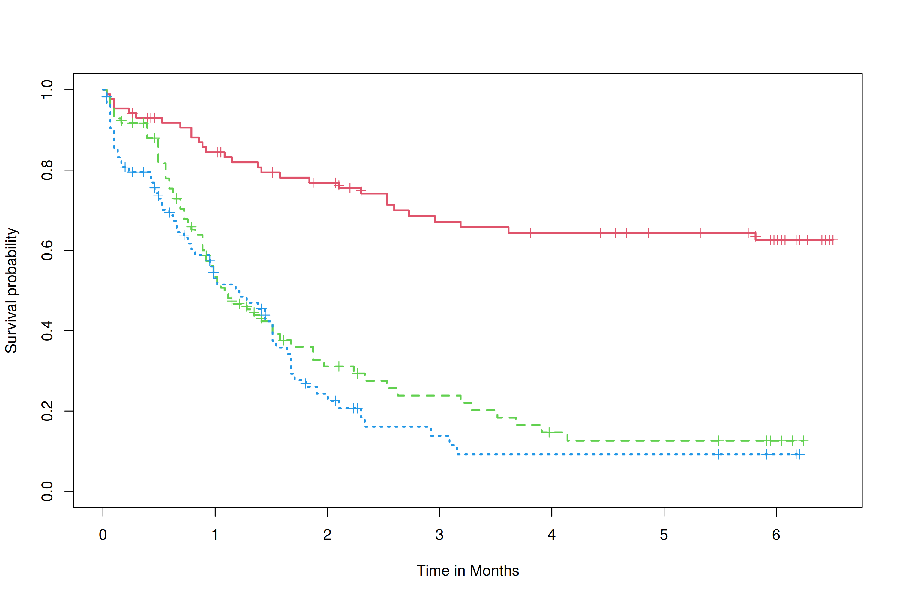

# Efficacy figure

Following the [ICH E3 guidance](https://database.ich.org/sites/default/files/E3_Guideline.pdf),
primary and secondary efficacy endpoints need to be summarized
in Section 11.4, Efficacy Results and Tabulations of Individual Participant.

```{r}
library(haven) # Read SAS data
library(dplyr) # Manipulate data
library(r2rtf) # Reporting in RTF format
library(survival) # Fit survival model
library(survminer) # K-M plot with risk table
library(forcats) # Reorder ordinal variable level based on preference
```

In this chapter, we illustrate how to create a Kaplan-Meier plot in a study.
For the survival analysis in efficacy, time to dermatologic event (TTDE) will be analyzed.

```{r, out.width = "100%", out.height = "450px", echo = FALSE, fig.align = "center"}

```

## Analysis dataset

To prepare the analysis, the `adtte` dataset is required.

```{r}
adtte <- read_sas("data-adam/adtte.sas7bdat")
```

First, to prepare the analysis ready data, 
filter all records for the efficacy endpoint of time to event of interest (`TTDE`) 
using `PARAMCD` (or `PARAM`, `PRAMN`), then select the survival analysis related variables:

- `TRTP`: treatment arm: (using corresponding numeric code `TRTAN` to re-order the levels, "Placebo" will be the reference level)
- `AVAL`: time-to-event analysis value
- `CNSR`: event (censoring) status

```{r}
adtte_ttde <- adtte %>%
  filter(PARAMCD == "TTDE") %>%
  select(TRTP, TRTAN, AVAL, CNSR) %>%
  mutate(TRTP = forcats::fct_reorder(TRTP, TRTAN)) # Recorder levels
```

## Create Kaplan-Meier curve

The `survival` package is used to create the curve data points, 
then `survminer` package can be used to plot the K-M curve with an elegant `ggplot2` style. 
There are tons of customized options for users to create a K-M plot
with risk table and testing result (nominal p-value). 
More details can be found in `?survminer::ggsurvplot`.

Users can use `Surv()` with formula directly, 
or use a fitted Cox model with the `coxph()` function 
if we also want to obtain other information, i.e. hazard ratio, survival rates, etc. 
<!-- TODO: "Analysis of Survival Endpoint Table" Chapter -->

```{r}
fit <- survfit(Surv(AVAL, 1 - CNSR) ~ TRTP, data = adtte_ttde)
```

```{r}
fig_km <- ggsurvplot(
  fit,
  xlab = "Time in Months",
  ylab = "Survival Probability",
  break.time.by = 30.4367,
  xscale = "d_m",
  xlim = c(0, 200),
  linetype = c(1, 2, 3),
  risk.table = TRUE,
  risk.table.height = 0.3, # Useful when you have multiple groups
  legend = c(0.8, 0.9), legend.title = "",
  legend.labs = sort(unique(adtte_ttde$TRTP)),
  censor.size = 4,
  size = 0.8,
  title = "",
  censor.shape = "|",
  pval = TRUE,
  pval.method = TRUE,
  pval.coord = c(0, 0.1),
  pval.method.coord = c(0, 0.2),
  pval.size = 5,
  ggtheme = theme_classic2(base_family = "Times New Roman", base_size = 18)
)
```

Then we can save the figure as a `.png` file, 
and use the `r2rtf` package to create a formatted RTF figure. 
More details can be found in <https://merck.github.io/r2rtf/articles/example-figure.html>.

```{r}
# Save as PNG file
ggsave("tlf/fig_km.png", plot = print(fig_km, newpage = FALSE), width = 10, height = 6)

# Create RTF figure
rtf_read_png("tlf/fig_km.png") %>% # Read PNG files from the file path
  rtf_title("Time to Dermatologic Event by Treatment Group", "All Participants") %>% # Add title or subtitle
  rtf_footnote("footnote") %>% # Add footnote
  rtf_source("[datasource: adam-adtte]") %>% # Add data source
  rtf_figure(fig_width = 6, fig_height = 3.6) %>% # Set proportional figure size to the original PNG figure size
  rtf_encode(doc_type = "figure") %>% # Encode rtf as figure
  write_rtf(file = "tlf/fig_km.rtf")
```

```{r, out.width = "100%", out.height = "400px", echo = FALSE, fig.align = "center"}
knitr::include_graphics("tlf/fig_km.pdf")
```

In conclusion, the procedure to generate the above efficacy K-M plot is summarized as follows.

- Step 1: Read the data `adtte` into R.
- Step 2: Define the analysis-ready dataset. In this example, we define the analysis dataset for the TTDE endpoint `adtte_ttde`.
- Step 3: Create the curve's data points using the `Surv()` formula directly 
or fitted survival models beforehand. Then plot and customize the K-M curve with risk table using the `survminer` package.
- Step 4: Save the output as a PNG file, then format it into an RTF table.
